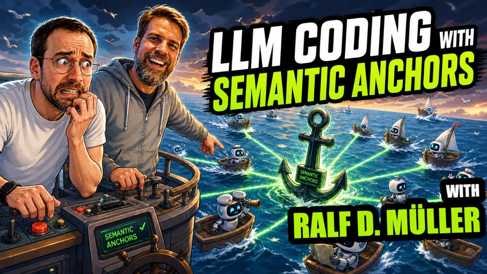

== LLM Coding with Semantic Anchors:Vibe Coding to Real App with Ralf D Müller

Most LLM-based apps struggle because they rely on vague prompts and “vibe coding.” In this live coding session, we show how to build a real Java application using Semantic Contracts and Semantic Anchors to make LLM-driven systems more predictable, structured, and reproducible.
 
In this session, I’m joined by https://www.linkedin.com/in/rdmueller[Ralf D. Müller], committer at https://arc42.org[arc42] and creator of https://doctoolchain.org[docToolchain], to explore a more structured approach to building applications with GenAI and LLMs.
 
Instead of treating LLMs as unpredictable black boxes, we introduce Semantic Anchors and Semantic Contracts to define clear expectations and guide behavior with well-defined structure. This helps move from trial-and-error prompting toward systems that are easier to understand, test, and evolve.
 
=== What you’ll learn

* Why “vibe coding” breaks down in real-world applications
* How **Semantic Anchors** help guide LLM behavior
* How **Semantic Contracts** improve consistency and clarity
* How to structure LLM interactions in a more engineering-driven way
* How to apply basic software architecture thinking to GenAI apps
 
=== What we build

We implement a simple train scheduling application for model railroads where users can:

* Define trains and stations
* Create and manage schedules
* Interact with the system using structured LLM workflows
 
The technical setup includes:

* Java + Quarkusio backend
* Vaadin UI
* PostgreSQL database
 
=== Why this matters

Many GenAI tutorials focus on prompt tricks. This session focuses on building systems you can reason about:

* Clear contracts instead of hidden assumptions
* More reproducibility instead of pure randomness
* Structure instead of guesswork
 
This is especially useful if you’re starting to apply software architecture principles to LLM-based applications.
 
=== Keywords

#LLM, #SemanticContracts, #SemanticAnchors, #GenAI, #Java, #Quarkus, #Vaadin, #PostgreSQL, #SoftwareArchitecture, #arc42, #docToolchain, #AIEngineering, #PromptEngineering, #LiveCoding, #AIDevelopment, #StructuredLLMSystems

https://llm-coding.github.io/Semantic-Anchors/

== Setup

=== Prerequisites

* Docker (with Compose v2)
* optional: Claude Code, for the LLM-driven parts of the session
+
[source,shell]
----
curl -fsSL https://claude.ai/install.sh | bash
----

=== Run the app

From the repository root:

[source,shell]
----
docker compose up --build
----

This starts two containers:

[cols="1,2,3", options="header"]
|===
| Service | Host port | URL / connection
| `app` (Quarkus + Vaadin) | 8080 | http://localhost:8080
| `db` (PostgreSQL)        | 15432 | `jdbc:postgresql://localhost:15432/semantic-anchors` (user: `semantic-anchors`, password: `not-secure`)
|===

The Postgres data directory is bind-mounted to `./db/data/` so the database survives container restarts.

=== Stop

[source,shell]
----
docker compose down
----

To also wipe the database, remove `./db/data/` afterwards.

=== Further reading

* https://llm-coding.github.io/Semantic-Anchors/[Semantic Anchors site]
* https://llm-coding.github.io/vibe-coding-risk-radar/[Vibe Coding Risk Radar] — a framework for systematically identifying and categorizing risks of AI-generated code
* https://rdmueller.github.io/pages/blog.html[Ralf D. Müller — Blog]
* https://unifiedprocess.ai/[Martinelli Unified Process]
* https://doctoolchain.org[docToolchain] — docs-as-code toolchain
** https://doctoolchain.org/dacli[dacli] — CLI for docs-as-code workflows with docToolchain
** https://doctoolchain.org/asciidoc-linter[AsciiDoc Linter] — linter for clean and consistent AsciiDoc
** https://doctoolchain.org/Bausteinsicht/[Bausteinsicht] — architecture-as-code: building blocks in JSONC, bidirectional sync with draw.io

